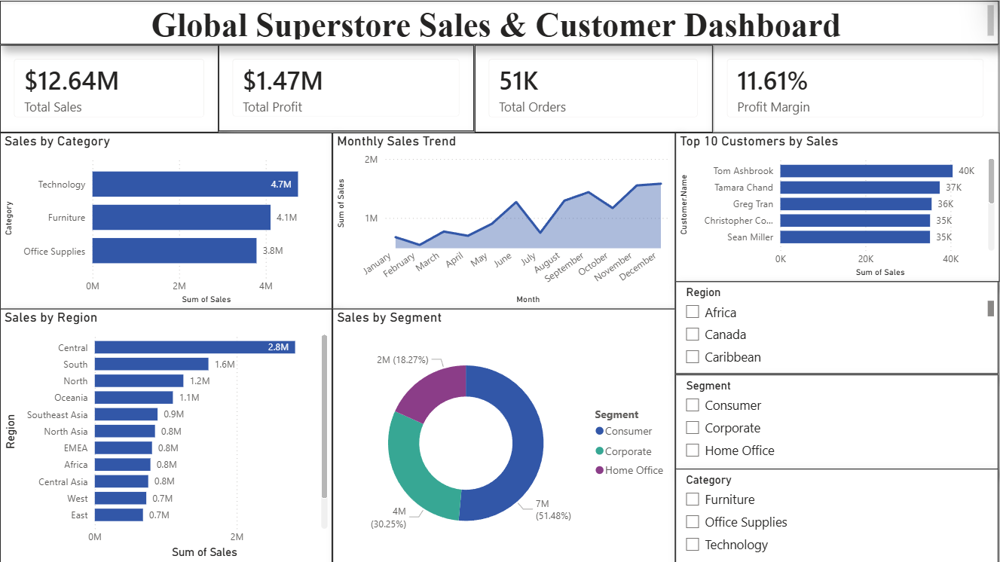

# Interactive Business Dashboard using Power BI

## 📌 Project Overview
This project is an interactive business dashboard created using Power BI and the Global Superstore dataset. The dashboard provides valuable insights into sales performance, customer behavior, regional performance, and profitability trends through interactive visualizations and filters.

The project demonstrates practical data analysis, dashboard designing, and business intelligence skills using Power BI.

---

## 📊 Features of Dashboard
- KPI Cards for:
  - Total Sales
  - Total Profit
  - Total Orders
  - Profit Margin

- Interactive Visualizations:
  - Sales by Category
  - Monthly Sales Trend
  - Top 10 Customers by Sales
  - Sales by Region
  - Sales by Segment

- Interactive Filters (Slicers):
  - Region
  - Segment
  - Category

- Dynamic and user-friendly dashboard design

---

## 🛠 Tools & Technologies Used
- Power BI
- Microsoft Excel
- Data Visualization
- Data Cleaning
- Business Intelligence
- Dashboard Design

---

## 📁 Dataset
Dataset used:
Global Superstore Dataset

---

## 📸 Dashboard Screenshots

### Main Dashboard

---

## 📈 Key Insights
- Technology category generated the highest sales
- Consumer segment contributed maximum revenue
- Sales showed continuous growth over the years
- Top customers contributed significantly to total revenue
- Regional analysis helped identify high-performing markets

---

## 🎯 Learning Outcomes
- Built an interactive dashboard using Power BI
- Learned data visualization techniques
- Applied business intelligence concepts
- Improved analytical and reporting skills
- Gained hands-on experience with slicers, KPI cards, and charts

---

## 👤 Author
**Devansh Goel**  
B.Tech (CSE) Student  
Aspiring Data Analyst | Power BI Enthusiast
